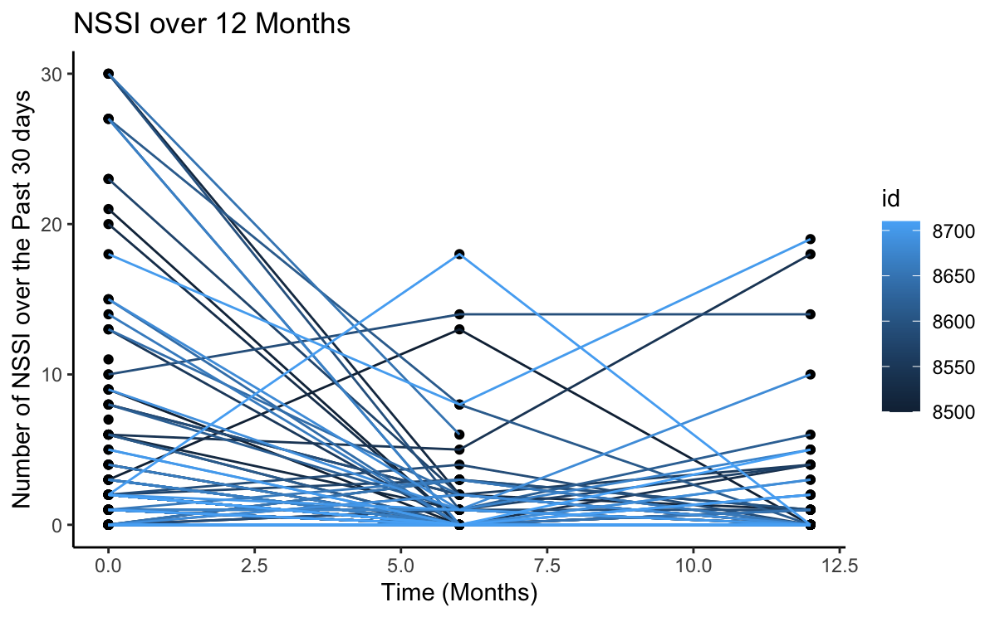

## NSSI Trajectory

```{r, echo = FALSE}

#\includegraphics["trajectory.png"]
```


## Univariate Test of Predictors for 6 months NSSI Outcomes
Predictor              | Significant  | p-value
-----------------------|--------------|------------------
Sex                    | Yes          | 0.000234
Race                   | No           | 0.912
Age                    | No           | 0.207
Baseline NSSI          | Yes          | 0.001175
SIQ                    | Yes          | 5.96e-08 
CDI                    | Yes          | 0.001439
DERS                   | No           | 0.360
ERS                    | No           | 0.1041
cFace(DANVA)           | No           | 0.372
aFace(DANVA)           | No           | 0.656
Keep the significant variables, sex, baseline NSSI, SIQ, and CDI.

From the univariate test, we can see that sex, baseline NSSI, SIQ, and CDI are significantly related to the outcome. As a result, I kept these variables in building my model. 

## Final Model for Predicting Non-Suicidal Injury at 6 Months
Predictor              | RR           | 95% Confidence Interval 
-----------------------|--------------|------------------------
(Intercept)            | 0.0065       | 0.000737, 0.03496
Sex1 (Female)          | 6.10         | 1.268, 44.7399
Baseline               | 1.060        | 1.0052, 1.1358
SIQ                    | 1.060        | 1.0320, 1.094

Using both forward selection and backward selection, the model with sex, baseline NSSI, and SIQ yield the lowest AIC. Both these two automatic selections look at the p-value to make the selection. As a result, for the final model to predict non-suicidal injury at 6 months, the predictors are sex, baseline non-suicidal injury, and SIQ. From the model, we can see the risk ratio of non-suicidal injury at 6 months post psychiatric admission is 0.007 (95% confidence interval [CI], 0.0007 to 0.035). For female patients, the non-suicidal injury is 6 ([CI], 1.27 to 44.74) times higher than for male patients, holding all other variables constant. For every 1-point increase in baseline non-suicidal injury, the risk of non-suicidal injury is 1.06 ([CI], 1.005 to 1.136) times higher, holding other variables constant. For every 1-point increase in SIQ, the risk of non-suicidal injury is 1.06 ([CI], 1.032 to 1.094) times higher, holding other variables constant.
With this prediction model, we can see from the graphs that there are some outliers in the data. From the residual plots, we can see that some points are very far away from the fitted values. However, we can see from the leverage plot that even though these outliers have high residuals, they are low influence.

## Final Model for Predicting Non-Suicidal Injury at 12 Months
Predictor              | RR           | 95% Confidence Interval 
-----------------------|--------------|------------------------
(Intercept)            | 0.090        | 0.0188, 0.386
Sex1 (Female)          | 3.167        | 0.7140, 15.421
Baseline               | 1.124        | 1.0005, 1.313
M6                     | 1.319        | 0.9797, 2.1206

Using backward selection, the model with sex, baseline NSSI, and 6 months NSSI yielded the lowest AIC. As a result, for the final model to predict non-suicidal injury at 12 months, the predictors are sex, baseline non-suicidal injury, and 6 months NSSI. From the model, we can see the risk ratio of non-suicidal injury at 12 months post psychiatric admission is 0.09 (95% confidence interval [CI], 0.0019 to 0.386). For female patients, the non-suicidal injury is 3.17 ([CI], 0.714 to 15.42) times higher than for male patients, holding all other variables constant. For every 1-point increase in baseline non-suicidal injury, the risk of non-suicidal injury is 1.124 ([CI], 1.00 to 1.31) times higher, holding other variables constant. For every 1-point increase in non-suicidal injury at 6 months, the risk of non-suicidal injury is 1.32 ([CI], 0.9798 to 2.121) times higher, holding other variables constant.
With this prediction model, we can see from the graphs that there are some outliers in the data. From the residual plots, we can see that some points are very far away from the fitted values. However, we can see from the leverage plot that even though these outliers have high residuals, they are low influence.

